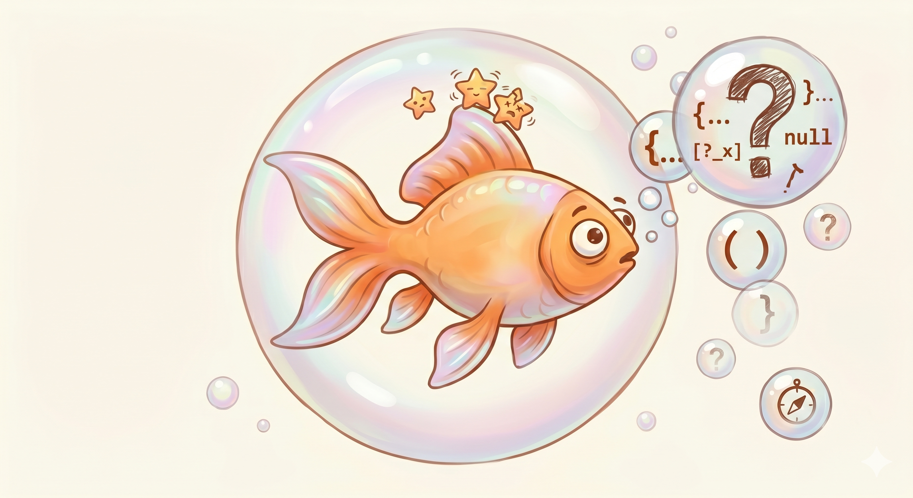

<p align="center">
  
</p>

<h1 align="center">goldfish</h1>

<p align="center">
  <strong>Persistent memory for Claude Code agents.</strong><br>
  One command installs and wires together GitNexus, OMEGA, and Semble so your AI agent<br>
  never starts a session from scratch again.
</p>

<p align="center">
  <a href="LICENSE"></a>
  
  
</p>

---

## Quick start

**Prerequisites:** Python 3.13+, Node.js 18+, [uv](https://docs.astral.sh/uv/) (`curl -LsSf https://astral.sh/uv/install.sh | sh`)

```bash
# Run directly from GitHub (PyPI listing coming soon)
uvx --from git+https://github.com/miztertea/goldfish goldfish init
```

Or install as a persistent tool:

```bash
uv tool install git+https://github.com/miztertea/goldfish
goldfish init
```

The init wizard detects and installs all dependencies, indexes your codebase, scaffolds your memory vault, and registers Claude Code hooks. Re-running is safe — it reports health and skips what's already installed.

If you have prior Claude Code sessions in this project, seed OMEGA with their history:

```bash
goldfish mine
```

---

## The problem

Claude Code agents are stateless. Every session starts from zero. You spend 10–30 minutes re-explaining context that was established yesterday. The agent repeats mistakes it already made, asks questions already answered, and changes a function without knowing 47 others depend on it.

The tools to fix this exist. Nothing connects them. That's the gap goldfish fills.

| Failure | Cause | Solution |
|---------|-------|---------|
| Session amnesia | Agent starts blank every session | OMEGA episodic memory mines JSONL logs |
| Codebase blindness | Agent doesn't know the shape of the code | GitNexus code knowledge graph |
| Decision blindness | Agent doesn't know why things are built this way | Vault markdown notes + OMEGA |
| Impact blindness | Agent doesn't know what breaks when it changes something | GitNexus blast-radius analysis |
| Prompt deafness | Agent gets generic context, not prompt-specific context | Chonkie + Semble + OMEGA fan-out |

---

## How it works

goldfish installs four layers of intelligence into Claude Code — each maintained by a dedicated open-source tool or human maintainer.

| Layer | Installed by | What it provides |
|-------|-------------|-----------------|
| **Layer 0 — Memory** | You | User preferences, behavioral feedback, reference pointers (plain markdown) |
| **Layer 1 — Tool-native** | GitNexus, OMEGA, Semble (via `goldfish init`) | Each tool's own hooks, MCP server, and agent instructions |
| **Layer 2 — Coordination** | goldfish | Cross-tool orchestration — tells agents to query all three tools before acting |
| **Layer 3 — Project-specific** | You (or your agent) | Codebase-specific guardrails, architecture context, contributor workflow |

goldfish itself is ~500 lines of Python — a thin orchestration layer with no search, embedding, or graph code. Every function is a subprocess call, a file write, or a config read.

### How the tools connect

```
Claude Code JSONL logs         ← source of truth
       ↓ mined by OMEGA
SQLite episodic store          ← past decisions, lessons, errors
       ↓ written by goldfish
~/.goldfish/vaults/{project}/  ← plain markdown vault (human-readable)
       ↑ indexed by GitNexus
Code knowledge graph           ← symbols, callers, execution flows
       ↑ searched by Semble
Prompt enrichment              ← context injected before every task
       ↑ decomposed by Chonkie
```

### Hook lifecycle

| Event | What happens |
|-------|-------------|
| `SessionStart` | Drains queue, generates wake-up context from vault + OMEGA |
| `UserPromptSubmit` | Decomposes prompt → fans out to Semble (code + vault) + OMEGA → injects context |
| `PreCompact` | Drains queue, writes checkpoint note to vault |
| `TaskCreated` / `TaskCompleted` | Writes task notes to vault |
| `Stop` / `SessionEnd` | Advances JSONL offset in manifest |

All async events write to `~/.goldfish/queue.jsonl` first and return in <10ms so Claude never blocks.

---

## Vault

All knowledge is plain markdown — readable with `cat`, searchable with `grep`, versionable with `git`.

```
~/.goldfish/vaults/{project}/
├── .manifest.toml           ← sync state (byte offset, timestamps)
├── Memory/
│   ├── Decisions/           ← architectural choices and rationale
│   ├── Lessons/             ← patterns learned across sessions
│   ├── Errors/              ← bugs and fixes
│   └── Checkpoints/        ← pre-compaction snapshots
├── Specs/                   ← feature specs referenced by tasks
├── Tasks/                   ← task notes (created/completed events)
└── _context/
    └── wake-up.md           ← refreshed every session
```

Each note uses temporal frontmatter so agents can tell what's current and what's superseded:

```yaml
---
id: decision-jwt-auth-2026-05-24
type: decision
valid_from: 2026-05-24
superseded_by: null
confidence: 0.94
source_session: abc123
---
```

Want a visual graph of the knowledge store? See [docs/obsidian.md](docs/obsidian.md).

---

## CLI reference

```
goldfish init              Run the setup wizard
goldfish mine              Seed OMEGA from historical JSONL session logs (run once on onboarding)
goldfish status            Show queue depth, manifest state, and sync timestamps
goldfish doctor            Check all dependencies and report with fix instructions
goldfish register-hooks    Re-register hooks with the correct binary path
goldfish replay            Rebuild vault from JSONL transcripts (resumable)
goldfish hook              Handle a hook event from stdin (called by Claude Code)
goldfish drain             Process queued events from ~/.goldfish/queue.jsonl
```

---

## Platform support

Tested on a clean install of **Ubuntu 26.04 LTS**. Expected to work on other Linux distributions and macOS — not yet verified. Windows is out of scope for v1.

---

## Development

```bash
git clone https://github.com/miztertea/goldfish
cd goldfish
uv sync
uv run pytest
```

Tests stub all subprocess calls and run without live tool installations. ~100 tests, ~0.3s.

```bash
uv run pytest -v          # verbose test output
uv run goldfish --help    # run CLI from source
```

---

## Contributing

Human contributors: [CONTRIBUTING.md](CONTRIBUTING.md)  
AI agent contributors: [AGENTS.md](AGENTS.md)

---

## License

MIT — see [LICENSE](LICENSE).
